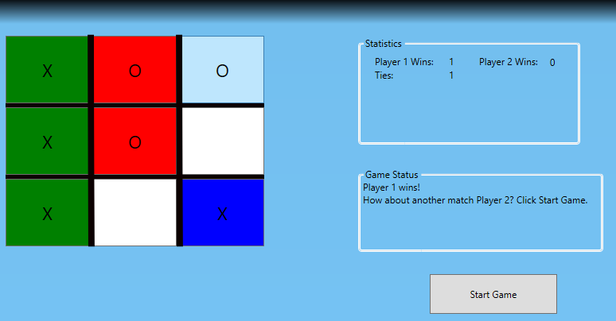
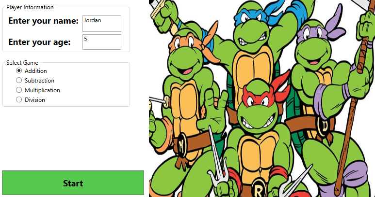

# CSharp-with-WPF
Here are some apps made with Windows Pro Forms using C#

This is a preview of the "Airline Seat Manager ✈️"

This is a preview of the "TicTacToe game ✖ ⚪"

This is a preview of the "Math game (TMNT theme) 🐢"

