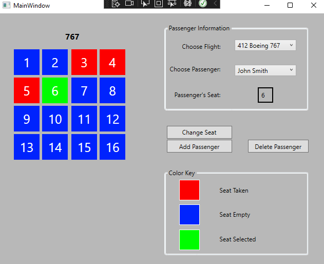

# CSharp-with-WPF
Here are some apps made with Windows Pro Forms using C#

This is a preview of the "Airline Seat Manager ✈️" This was actually really interesting to implement a GUI for changing seats on a flight. My first database had default values of Seinfeld characters such as Jerry Seinfeld, George Costanza, etc. 

This is a preview of the "TicTacToe game" It was a good time to make, but I discovered I shouldn't play TicTacToe against myself.

This is a preview of the "Math game (TMNT theme) 🐢". This was a lot of fun to make and don't forget. Cowabunga!

